# Shopify and RedTrack


[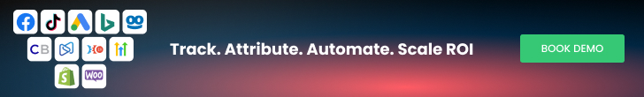](https://www.redtrack.io/integrations/shopify-integration)

[Shopify](https://www.shopify.com/free-trial?term=shopify&adid=565751954577&campaignid=15439902878&branded_enterprise=1&BOID=brand&gclid=CjwKCAjwyNSoBhA9EiwA5aYlb3j_zPy8yzQv5WGaiKs4uOO4raIOPuNhIZ0WxCbxqXluUpfYU3-mZRoCZoQQAvD_BwE&cmadid=516586848;cmadvertiserid=10730501;cmcampaignid=26990768;cmplacementid=324286430;cmcreativeid=163722649;cmsiteid=5500011) is the leading cloud-based, multi-channel commerce platform. Merchants can use the software to design, set up, and manage their stores across multiple sales channels, including web, mobile, social media, marketplaces, brick-and-mortar locations, and pop-up shops. The Shopify platform was engineered for reliability and scale, making enterprise-level technology available to businesses of all sizes.

RedTrack allows you to have an API integration with Shopify. That means:

* All your conversion events are tracked on the backend automatically
* The highest level of accuracy for conversion and revenue delivery

Integration
-----------

Important before you start


The [custom tracking domain](https://help.redtrack.io/knowledgebase/kb/conversion-tracking/adding-custom-domain/) should be connected to your RedTrack account before proceeding with the connection steps below.


RedTrack steps


1. Create custom conversion events.

Tools → Conversion tracking → Conversion types → add the events for Shopify. Use [this guide](https://help.redtrack.io/knowledgebase/kb/basic-setup-9785/conversions-12026/tracking-event-types/) to help you add the events, set up postback modes from them, etc.

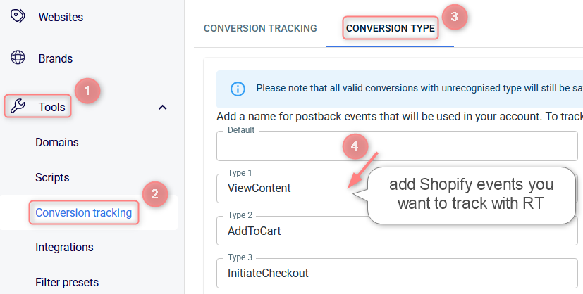

Here’s the list of Shopify events you can track with RT:

* **ViewContent**
* **AddToCart**
* **InitiateCheckout**
* **Purchase**
* **Upsell**  
  *To track this event properly, add it in RT + set up a Webhook in Shopify (Webhook setup is described in the Connection steps section of this guide → step 3)*.
* **PartialRefund**  
  *This event is counted with a minus payout. To track this event properly, add it in RT + set up a Webhook in Shopify (Webhook setup is described in the Connection steps section of this guide → step 3)*.
* **Refund**  
  *This event is counted with a minus payout. **To track this event properly, add it in RT + set up a Webhook in Shopify (Webhook setup is described in the Connection steps section of this guide → step 3)*.**
* **BuyNow**  
  *This event should be applied if your page has a button “Buy Now”.*
* **Shipping**  
  *This event type presupposes the cost of shipping minus the cost of purchase and the Payout value for this event type is counted with a minus*.

If you don’t add **Shipping** as an event, conversions that are supposed to be counted as **Shipping** and have a negative revenue will be counted as **default conversions** but marked with a minus. That being said, **Total Revenue** will count all the conversions, including the minus ones.

* **Subscription**  
  *To set up this event type for Recharge subscribers refer to [this article](https://help.redtrack.io/knowledgebase/kb/partner-templates-channels/integrations-other-tools/e-com-integrations/shopify-private-app-integration/shopi-new-event-types-12672/).*
* **Recurring**  
  **To set up this event type for Recharge subscribers refer to [this article](https://help.redtrack.io/knowledgebase/kb/partner-templates-channels/integrations-other-tools/e-com-integrations/shopify-private-app-integration/shopi-new-event-types-12672/).**
* **Cancelled**  
  *This event type presupposes manually and automatically cancelled orders from Shopify. **To track this event properly, add it in RT + set up a Webhook in Shopify (Webhook setup is described in the Connection steps section of this guide → step 3)*.**

2. Create a custom Brand.

Brands → New from scratch → use [this guide](https://help.redtrack.io/knowledgebase/kb/basic-setup-9785/specific-for-advertisers-only-9832/adding-brand-and-website-8625/) to help you set up your brand properly.

3. To send the PII data for better attribution go to the added Brand settings → Additional parameters → add the following parameters with the corresponding roles:

| Parameter | Macro / Token | Name / Description (what you will see in reports instead of subx) | **Role** | **Info we receive under these parameters** |
| --- | --- | --- | --- | --- |
| eventid | {replace} | Event ID | Event ID | Your order ID or the external ID for the conversion |
| fname | {replace} | First Name | First Name | Customer First Name from the order |
| lname | {replace} | Last Name | Last Name | Customer Last Name from the order |
| phone | {replace} | Phone | Phone | Customer phone number from the order |
| email | {replace} | Email | Email | Customer email from the order |
| zip | {replace} | Zip Code | Zip Code | Customer zip code from the order |
| contentid | {replace} | Content ID | Content IDs | External product ID |
| content | {replace} | Content | Contents | Product title |
| contenttype | {replace} | Content Category | Content Category | The type of product |


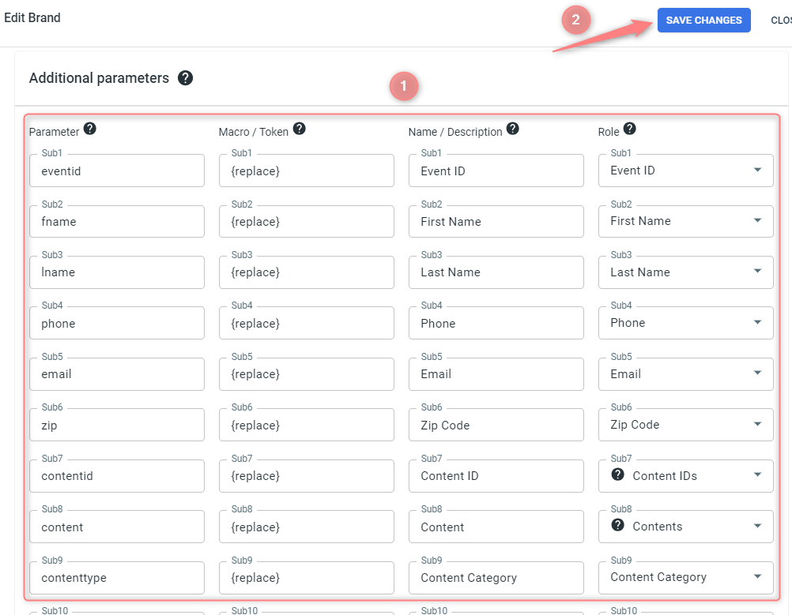

4. Add your Website.

Websites → New → use [this guide](https://help.redtrack.io/knowledgebase/kb/basic-setup-9785/specific-for-advertisers-only-9832/adding-brand-and-website-8625/) to help you add your website.

Once you’ve added your Website, you already have all the essential scripts, pixel and webhooks generated automatically in the **Scripts** tab:  
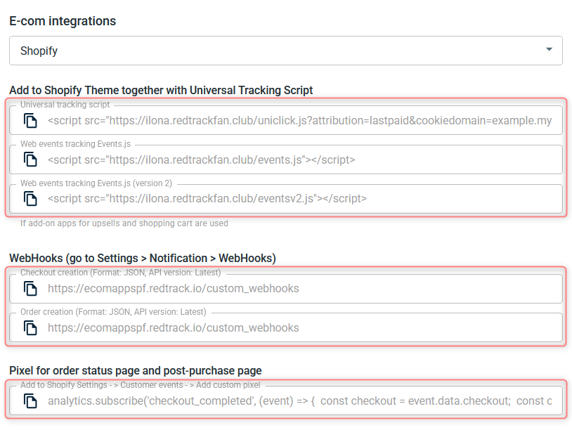  
You will need them later to connect to Shopify.

5. Create a paid traffic campaign.

The campaign for the unattributed (organic) traffic is already in place. Now you need to create the one for the paid traffic. Follow these simple steps:

* Add the [Traffic channel](https://help.redtrack.io/knowledgebase/kb/partner-templates-channels/integrations-traffic-channels-9777/). Most of them have a preset template in RedTrack.
* [Launch a campaign](https://help.redtrack.io/knowledgebase/kb/basic-setup-9785/specific-for-advertisers-only-9832/creating-campaign-guide-for-advertisers-8634/) for the paid Traffic channel. Your website/shop will be the main link added to the traffic channel.


Shopify steps


1. Create a custom app.

* Log in to your Shopify →Apps → Apps and sales channel settings → Develop apps for your store:

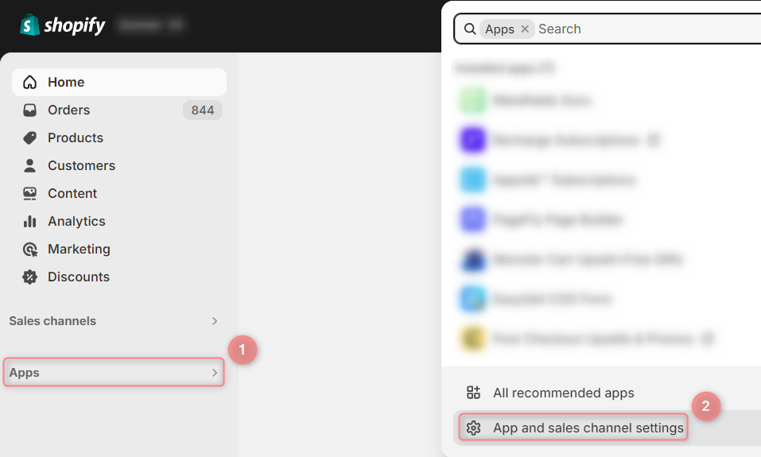
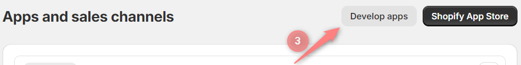

* Create an app → add the name in the *App name* field → choose the developer from the *App developer* drop-down list → Create app:

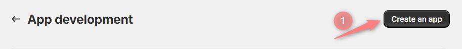
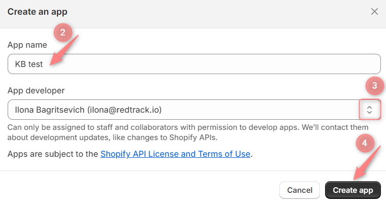

2. Configure API scopes.

2.1 Overview → Configure API scopes:

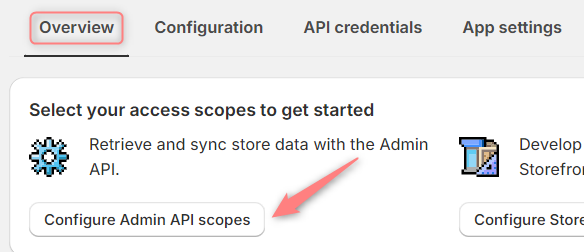

2.2 Admin API access scopes → All → Order editing, Orders, Script tags → tick the following boxes next to them:

* **Order editing**: write, read
* **Orders**: write, read
* **Script tags**: write, read

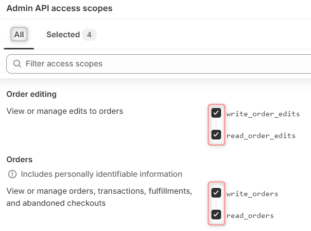
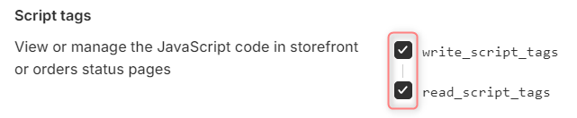

2.3 In the Selected tab you can re-check if everything was added. Save the changes and install the app:

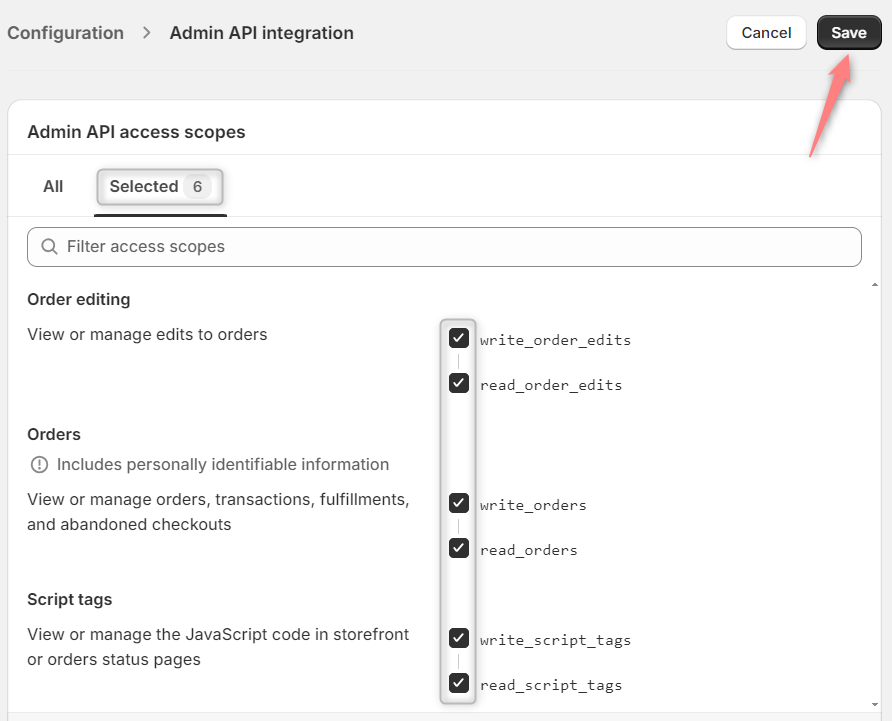
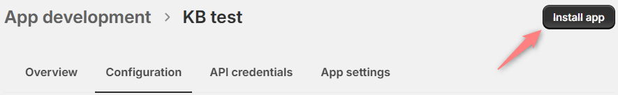

3. Reveal the token.

3.1 A warning message will pop up informing you that the **access token can only be viewed once** and will be revealed to you once you press **Install**:

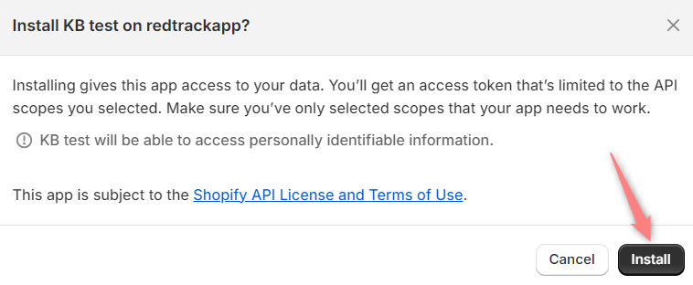

3.2 Reveal token once → save it:

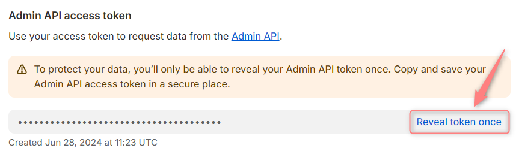


Connection steps


1. Connect your RedTrack account to the Shopify Private App.

In RT go to Tools → Integrations → Shopify → Add Shopify store → add your shop id and token:

* **Shop id**: copy it from the URL, it is **yourshopname.myshopify.com**.
* **Token**: Shopify token you got during the private app creation.

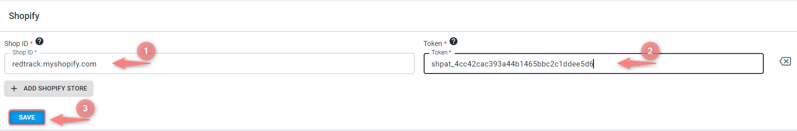

2. Add the needed scripts from RedTrack to Shopify:

**Scripts for theme.liquid**
**Pixel for tracking upsells**


1. Copy the scripts from the added Website form.

Websites → edit Website form → Scripts → select Shopify → copy the scripts:

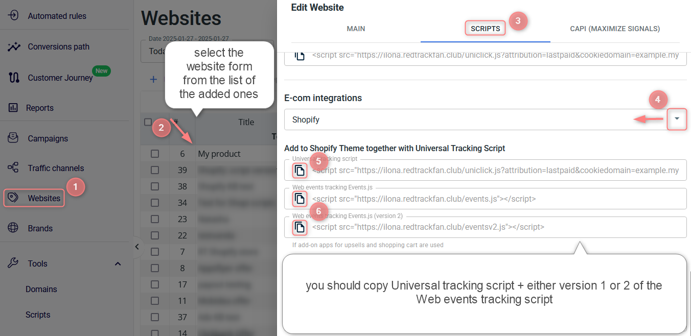
**Web events tracking Events.js (version 2)** script is designed to ensure accurate tracking of **Add To Cart** eventswhen third-party apps for upsells and add-to-cart are being used.   
  
**DO NOT install both versions** of the script, as it will lead to conflict. 

Open this if you **don’t have the generated scripts in your account**


If you have the Offer form and no automatically generated scripts, then you need to:

* Create and copy the universal tracking script. Use [this article](https://help.redtrack.io/knowledgebase/kb/conversion-tracking/universal-script/) → I’m affiliate section.
* Copy this Web events tracking Events.js script:

```
<script src="https://yourtrackingdomain.com/events.js"></script>
```


2. Add the copied scripts to your Shopify account.

2.1 Sales channels → Online Store → Themes → three dots → Edit code:

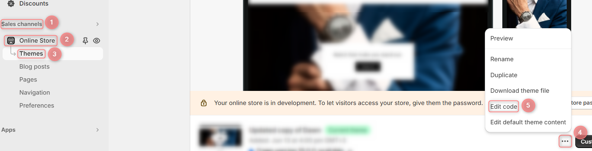

2.2 Layout → theme.liquid → add the copied scripts to the end of the *<head>* tag:

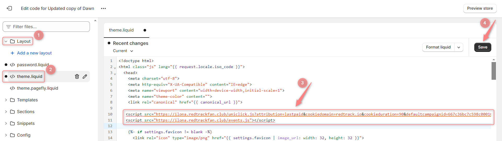
If you change the theme, remember to add the scripts to the new theme again.

1. Copy the pixel from the Website form.

Websites → choose the needed one → Scripts → choose Shopify → copy the Pixel for order status page and post-purchase page:

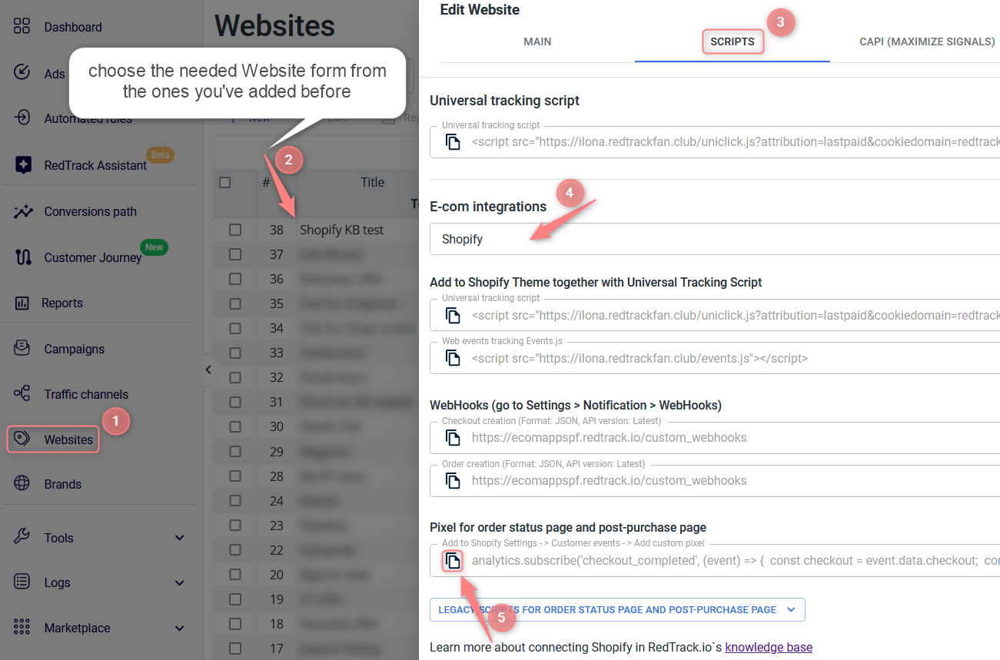
Legacy scripts for Order status page and Post purchase page can be still found in your Website form in the Legacy scripts for Order status page and Post-Purchase page drop-down:  
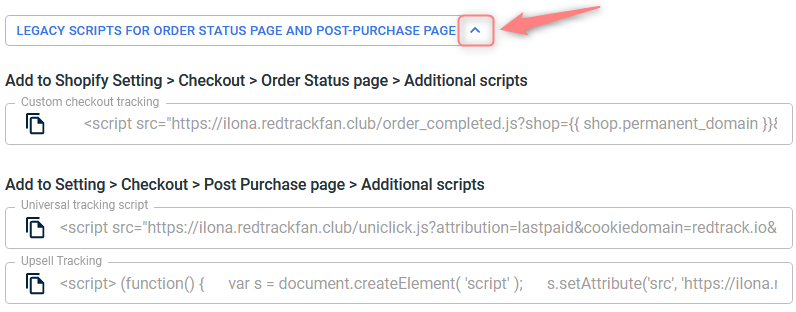

Open this if you **don’t have the generated pixel in your account**


If you have the Offer form and no automatically generated pixel, copy it from here:

```
analytics.subscribe('checkout_completed', (event) => {
  const checkout = event.data.checkout;
  const orderId = checkout.order.id;
  var s = document.createElement( 'script' );
  s.setAttribute('src', 'https://tracking.domain/order_completed.js?shop=storedomain.myshopify.com&orderid=' + orderId);
  document.body.appendChild(s);
});
```


2. Add the copied pixel to your Shopify account.

2.1 Settings → Customer events → Add custom pixel → give it a name → Add pixel:

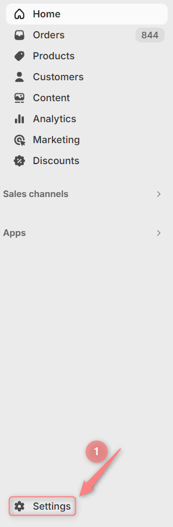
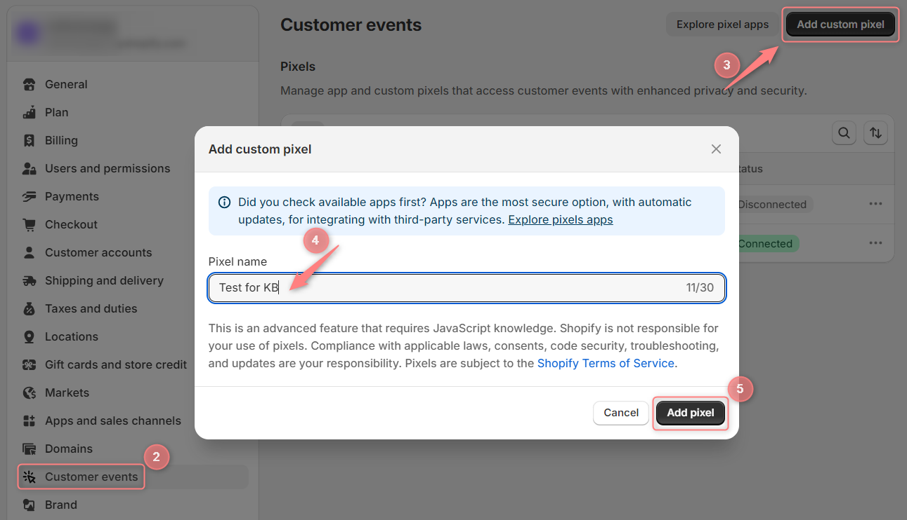

2.2 In the *Permission window* mark **Analytics** → in the *Data sale* window mark **Data collected qualifies as data sale**:

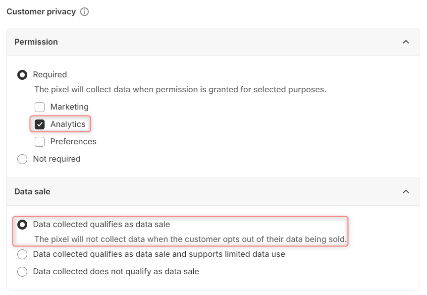

2.3 Paste the pixel (copied in step 1) into the Code section → change the **tracking.domain** and **store.domain** parts with your actual domains → Connect:

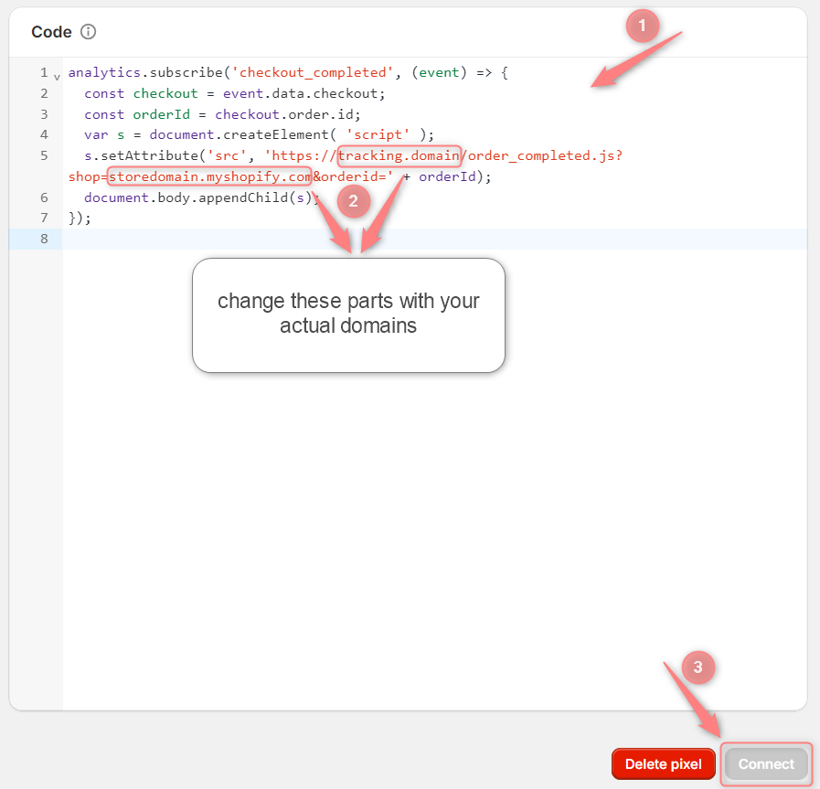

3. Create Webhooks.

Settings → Notifications → Webhooks → Create webhook:

**Webhook API version** is always the **latest**. It is crucially important for you to choose the latest version of Webhook API from the dropdown. Usually, the latest Webhook API version is marked with the current year and the word **(Latest)** at the end.
**Checkout creation** (mandatory)
**Order creation** (mandatory)
**Order edit** (optional, add it if you need to track *Upsell*events)
**Refund create** (optional, add it if you need to track *Partial Refund* and/or *Refund* events)
**Cancelled** (optional, add it if you need to track *Cancelled* events)


* Event:Checkout creation
* Format: JSON
* URL: https://ecomappspf.redtrack.io/custom\_webhooks

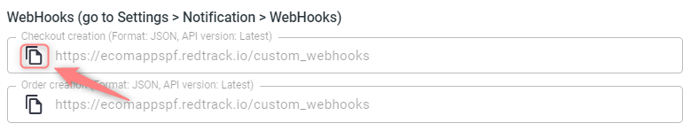

* Event: Order creation
* Format: JSON
* URL: https://ecomappspf.redtrack.io/custom\_webhooks

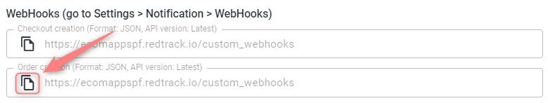

**Order edit** webhook should be added only for Upsell event tracking.

* Event: Order edit
* Format: JSON
* URL: https://ecomappspf.redtrack.io/custom\_webhooks

* Event: Refund create
* Format: JSON
* URL: https://ecomappspf.redtrack.io/custom\_webhooks

* Event: Cancelled
* Trigger: order cancellation
* Webhook: https://ecomappspf.redtrack.io/custom\_webhooks


**Important!**  
▸ If you want to track **manually added orders in Shopify** with RedTrack, refer to [this article](https://help.redtrack.io/knowledgebase/kb/partner-templates-channels/integrations-other-tools/e-com-integrations/shopify-private-app-integration/shopify-adding-manual-orders-14023/) for additional setup steps.  
▸ If your **Shopify store domain or/and custom tracking domain were changed** you must update these domains in RedTrack and/or Shopify for correct tracking. Refer to [this article](https://help.redtrack.io/knowledgebase/kb/partner-templates-channels/integrations-other-tools/e-com-integrations/shopify-private-app-integration/shopify-domain-changes-14111/) for additional setup steps.  
▸ If you use a **landing page before the shop**, plus the landing page and Shopify shop domains are different, refer to [this article](https://help.redtrack.io/knowledgebase/kb/basic-setup-9785/specific-for-advertisers-only-9832/landing-page-before-e-com-shop/) for setup.

#### Articles

* [Shopify: domain changes](https://help.redtrack.io/knowledgebase/kb/automation/e-com-integrations/shopify-private-app-integration/shopify-domain-changes-14111/)
* [Shopify: Recharge subscribers](https://help.redtrack.io/knowledgebase/kb/automation/e-com-integrations/shopify-private-app-integration/shopi-new-event-types-12672/)
* [Shopify: adding manual orders](https://help.redtrack.io/knowledgebase/kb/automation/e-com-integrations/shopify-private-app-integration/shopify-adding-manual-orders-14023/)
* [Shopify: other platform subscribers](https://help.redtrack.io/knowledgebase/kb/automation/e-com-integrations/shopify-private-app-integration/shopi-plus-other-platform-subscriptions-12987/)
 

* Tagged:
* [add shopify](https://help.redtrack.io/doc-tag/add-shopify/)
* [API integration](https://help.redtrack.io/doc-tag/api-integration/)
* [connect shopify](https://help.redtrack.io/doc-tag/connect-shopify/)
* [e-com shop](https://help.redtrack.io/doc-tag/e-com-shop/)
* [shopify](https://help.redtrack.io/doc-tag/shopify/)
* [shopify integration](https://help.redtrack.io/doc-tag/shopify-integration/)
* [shopify pixel](https://help.redtrack.io/doc-tag/shopify-pixel/)
* [shopify redtrack integration](https://help.redtrack.io/doc-tag/shopify-redtrack-integration/)
* [shopify theme liquid](https://help.redtrack.io/doc-tag/shopify-theme-liquid/)

Was this page helpful? 
[Yes](# "1 person found this useful") 
[No](# "No votes yet") 


#### Related articles

* [Adnium and RedTrack](https://help.redtrack.io/knowledgebase/kb/automation/traffic-source-integration-status-2/adnium/)
* [Facebook and RedTrack](https://help.redtrack.io/knowledgebase/kb/automation/traffic-source-integration-status-2/facebook-and-instagram/)
* [Landing page before e-commerce shop](https://help.redtrack.io/knowledgebase/kb/tracker-setup-for-advertisers/landing-page-before-e-com-shop/)
* [Bing Ads and RedTrack](https://help.redtrack.io/knowledgebase/kb/automation/traffic-source-integration-status-2/bing-ads/)
* [Tonic (traffic channel) and RedTrack](https://help.redtrack.io/knowledgebase/kb/automation/traffic-source-integration-status-2/tonic-2/)
* [Google Ads and RedTrack](https://help.redtrack.io/knowledgebase/kb/automation/traffic-source-integration-status-2/google-ads-integration/)
* [ClickBank and RedTrack (INS integration)](https://help.redtrack.io/knowledgebase/kb/automation/integrated-affiliate-networks/clickbank/)
* [ReachEffect and RedTrack](https://help.redtrack.io/knowledgebase/kb/automation/traffic-source-integration-status-2/reacheffect/)
* [HilltopAds and RedTrack](https://help.redtrack.io/knowledgebase/kb/automation/traffic-source-integration-status-2/hilltopads/)
* [AdMaven and RedTrack](https://help.redtrack.io/knowledgebase/kb/automation/traffic-source-integration-status-2/admaven/)
* [Revcontent and RedTrack](https://help.redtrack.io/knowledgebase/kb/automation/traffic-source-integration-status-2/revcontent/)
* [MegaPu.sh and RedTrack](https://help.redtrack.io/knowledgebase/kb/automation/traffic-source-integration-status-2/megapu-sh/)
* [WooCommerce and RedTrack](https://help.redtrack.io/knowledgebase/kb/automation/e-com-integrations/redtrack-io-woocom-plugin-setup/)
* [RichPush and RedTrack](https://help.redtrack.io/knowledgebase/kb/automation/traffic-source-integration-status-2/richads/)
* [Taboola and RedTrack](https://help.redtrack.io/knowledgebase/kb/automation/traffic-source-integration-status-2/taboola/)
* [Zeropark and RedTrack](https://help.redtrack.io/knowledgebase/kb/automation/traffic-source-integration-status-2/zeropark/)
* [TrafficStars and RedTrack](https://help.redtrack.io/knowledgebase/kb/automation/traffic-source-integration-status-2/trafficstars/)
* [Newsbreak and RedTrack](https://help.redtrack.io/knowledgebase/kb/automation/traffic-source-integration-status-2/newsbreak/)
* [TikTok and RedTrack](https://help.redtrack.io/knowledgebase/kb/automation/traffic-source-integration-status-2/tiktok/)
* [TrafficJunky and RedTrack](https://help.redtrack.io/knowledgebase/kb/automation/traffic-source-integration-status-2/trafficjunky/)
* [Exoclick and RedTrack](https://help.redtrack.io/knowledgebase/kb/automation/traffic-source-integration-status-2/exoclick/)
* [PrestaShop and RedTrack](https://help.redtrack.io/knowledgebase/kb/automation/e-com-integrations/prestashop/)
* [Pushground and RedTrack](https://help.redtrack.io/knowledgebase/kb/automation/traffic-source-integration-status-2/pushground/)
* [PropellerAds and RedTrack](https://help.redtrack.io/knowledgebase/kb/automation/traffic-source-integration-status-2/propellerads/)
* [Outbrain and RedTrack](https://help.redtrack.io/knowledgebase/kb/automation/traffic-source-integration-status-2/outbrain/)
* [AppLovin and RedTrack](https://help.redtrack.io/knowledgebase/kb/automation/traffic-source-integration-status-2/applovin-and-redtrack/)
* See More


